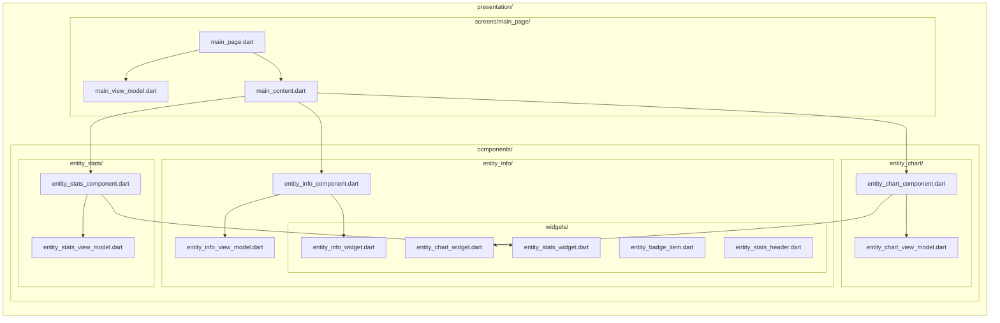

# Triple T - Architecture Guidelines (Component-Based Approach)

> **Project**: Triple T - Tic-Tac-Toe Strategy Game  
> **Version**: 1.0.0+1  
> **Flutter SDK**: 3.10.8  
> **State Management**: Riverpod (hooks_riverpod)  
> **Navigation**: go_router  
> **Last Updated**: February 2026

This document describes the architecture of the Triple T project, a Flutter tic-tac-toe strategy game application organized as a multi-package workspace. The project follows a
component-based architecture approach based on Clean Architecture principles.

## Table of Contents

1. [Project Overview](#project-overview)
2. [Current Architecture](#current-architecture)
3. [Identified Issues](#identified-issues)
4. [Proposed Architecture](#proposed-architecture)
5. [Architecture Diagram](#architecture-diagram)
6. [Benefits of the New Architecture](#benefits-of-the-new-architecture)
7. [Detailed Code Examples](#detailed-code-examples)

---

## Project Overview

### 🎮 About Triple T

Triple T is a tic-tac-toe strategy game application built with Flutter. The project demonstrates modern Flutter architecture patterns with a modular, feature-based organization.

### 📦 Technology Stack

- **Framework**: Flutter 3.10.8 / Dart SDK 3.10.8
- **State Management**: Riverpod ecosystem
  - `hooks_riverpod` - Hooks integration with Riverpod
  - `riverpod_annotation` - Annotation-based provider generation
  - `flutter_hooks` - React-like hooks for Flutter
- **Navigation**: `go_router` - Declarative routing
- **Code Generation**:
  - `build_runner` - Code generation orchestration
  - `riverpod_generator` - Provider code generation
  - `freezed` - Immutable data classes
  - `json_serializable` - JSON serialization
- **Database**: Custom `tt_database` package
- **Internationalization**: Custom `tt_i18n` package with `flutter_localizations`
- **Workspace Management**: Melos

### 🎯 Project Features

The Triple T project is organized into modular features:

- **Game** (`features/game/`)
  - `game_data` - Game data layer (repositories, data sources)
  - `game_domain` - Game business logic (use cases, models)
  - `game_presentation` - Game UI (pages, widgets, router)

- **User** (`features/user/`)
  - `user_data` - User data management
  - `user_domain` - User business logic
  - `user_presentation` - User interface components

- **Settings** (`features/settings/`)
  - `settings_data` - Settings persistence
  - `settings_domain` - Settings business logic
  - `settings_presentation` - Settings UI

- **Statistics** (`features/statistics/`)
  - `statistics_presentation` - Game statistics display

- **Home** (`features/home/`)
  - `home_presentation` - Home page and navigation

- **Error** (`features/error/`)
  - `error_presentation` - Error handling UI

### 📦 Shared Packages

- **tt_database** - Database abstraction and entities
- **tt_i18n** - Internationalization and localization
- **tt_linter** - Custom lint rules and code quality

---

## Current Architecture

### Current Package Structure (Technical Organization)

The Triple T project currently follows a technical layer organization within each feature package:

```
packages/features/feature_name/
├── lib/
│   ├── feature_name.dart
│   └── src/
│       ├── data/
│       │   ├── entity/
│       │   │   ├── entity.dart
│       │   └── repository/
│       │       ├── entity_repository.dart
│       │       └── another_entity_repository.dart
│       ├── domain/
│       │   ├── model/
│       │   │   ├── model.dart
│       │   └── use_case/
│       │       ├── get_entity_use_case.dart
│       │       ├── update_entity_use_case.dart
│       │       └── delete_entity_use_case.dart
│       ├── presentation/
│       │   ├── provider/
│       │   │   ├── entity_provider.dart
│       │   │   └── entity_view_model.dart
│       │   ├── pages/
│       │   │   └── page/
│       │   │       ├── settings_page.dart
│       │   │       └── settings_content.dart
│       │   ├── state/
│       │   └── widget/
│       │       ├── entity_widget.dart
│       │       ├── header_widget.dart
│       │       ├── item_widget.dart
│       │       ├── empty_view.dart
│       │       └── footer_widget.dart
│       └── router/
│           └── providers/
│               └── feature_routes_providers.dart
```

### Key Architecture Principles

#### Layer Organization

**1. Screens (`presentation/pages/`)**

- One folder per page
- Contains: `page.dart`, `content.dart`, `view_model.dart`
- Screen watches its own ViewModel
- Content composes Components and Widgets

**2. Components (`presentation/components/`)**

- Reusable components across multiple screens
- Each component has its own ViewModel
- Structure: `component.dart` + `view_model.dart` + `widgets/`
- Component watches its ViewModel and passes data to pure Widgets

**3. Widgets (`presentation/widgets/`)**

- Simple widgets without business logic
- No Riverpod dependencies
- Receive all data through constructor
- Purely presentational (StatelessWidget)

---

## Architecture Diagram

### Screen Architecture Overview

```mermaid
graph TB
%% Style definitions
    classDef screenClass fill: #e1f5fe, stroke: #01579b, stroke-width: 3px, color: #000
    classDef contentClass fill: #f3e5f5, stroke: #4a148c, stroke-width: 2px, color: #000
    classDef componentClass fill: #e8f5e8, stroke: #1b5e20, stroke-width: 2px, color: #000
    classDef viewModelClass fill: #fff3e0, stroke: #e65100, stroke-width: 2px, color: #000
%% Screen Layer
    Screen["`**MainPage**
    📱 Entry point`"]
    ScreenVM["`**MainViewModel**
    🧠 Screen ViewModel`"]
%% Content Layer
    Content["`**MainContent**
    🎨 Component composition`"]
%% Autonomous components with their ViewModels
    InfosComponent["`**EntityInfoComponent**
    📋 Autonomous component`"]
    InfosVM["`**EntityInfoViewModel**
    🧠 Specialized ViewModel`"]
    InfosWidget["`**EntityInfoWidget**
    🎨 Pure widget`"]
    ChartComponent["`**EntityChartComponent**
    📊 Autonomous component`"]
    ChartVM["`**EntityChartViewModel**
    🧠 Specialized ViewModel`"]
    ChartWidget["`**EntityChartWidget**
    🎨 Pure widget`"]
    StatsComponent["`**EntityStatsComponent**
    💎 Autonomous component`"]
    StatsVM["`**EntityStatsViewModel**
    🧠 Specialized ViewModel`"]
    StatsWidget["`**EntityStatsWidget**
    🎨 Pure widget`"]
%% Connections
    Screen --> ScreenVM
    Screen --> Content
    Content --> InfosComponent
    InfosComponent --> InfosVM
    InfosComponent --> InfosWidget
    Content --> ChartComponent
    ChartComponent --> ChartVM
    ChartComponent --> ChartWidget
    Content --> StatsComponent
    StatsComponent --> StatsVM
    StatsComponent --> StatsWidget
%% Apply styles
    class Screen screenClass
    class Content contentClass
    class InfosComponent, ChartComponent, StatsComponent componentClass
    class ScreenVM, InfosVM, ChartVM, StatsVM viewModelClass
    class InfosWidget, ChartWidget, StatsWidget componentClass
```

### Folder Structure



---

## Benefits of the Architecture

### 1. **Functional Cohesion**

- Each feature is completely autonomous in its folder
- All elements related to a feature (screen, content, widgets, view model) are grouped together
- Facilitates understanding and maintenance

### 2. **Standardized Screen Structure**

Each screen follows the same structure:

- **`screen_name_page.dart`**: Page entry point, manages navigation and watches ViewModel
- **`screen_name_content.dart`**: Display logic and composition, separates different states (loading, error, success)
- **`screen_name_view_model.dart`**: State management and business logic for the screen

**Functional components** are in `presentation/components/`:

- **`component_name_component.dart`**: ConsumerWidget that watches its ViewModel and uses widgets
- **`component_name_view_model.dart`**: Component state management
- **`widgets/`**: Pure widgets (StatelessWidget) without Riverpod, receive data through constructor

### 3. **Improved Reusability**

- Components in `presentation/components/` reusable across multiple screens
- Pure widgets in `components/{name}/widgets/` without Riverpod dependencies
- Use cases and repositories remain centralized in `data/` and `domain/`
- Avoids code duplication

### 4. **Ease of Navigation and Development**

- Screen development in its own folder `screens/{screen_name}/`
- Shared components centralized in `components/`
- Tests grouped by screen or component
- Simpler onboarding for new developers

### 5. **Scalability**

- Adding new screens without impact on existing ones
- Reusable components easy to identify and maintain
- Easy extraction of screen or component into separate package
- Teams can work in parallel on different screens

### 6. **Clear Separation of Responsibilities**

- **Page**: Watches ViewModel, manages navigation and composition
- **Content**: Display logic, state management (loading/error/success), component composition
- **Component**: ConsumerWidget that watches its own ViewModel, reusable across screens
- **Widget**: Pure StatelessWidget without Riverpod, receives all data through constructor
- **ViewModel**: State management and business logic (screen or component)

---

## Detailed Code Examples

### 1. 🖥️ Screen Layer

```dart
// screens/main_page/main_page.dart
class MainPage extends ConsumerWidget {
  const MainPage({super.key});

  @override
  Widget build(BuildContext context, WidgetRef ref) {
    final state = ref.watch(mainViewModelProvider);

    return state.when(
      error: (error, trace) => const MainErrorContent(),
      loading: () => const MainLoadingContent(),
      data: (data) {
        return Scaffold(
          body: SafeArea(
            child: MainContent(data: data),
          ),
        );
      },
    );
  }
}
```

**Screen Responsibilities:**

- Watches its own ViewModel
- Manages navigation and global structure
- Delegates composition to Content

### 2. 🧠 Screen ViewModel

```dart
// screens/main_screen/main_view_model.dart
@riverpod
class MainViewModel extends _$MainViewModel {
  @override
  Future<EntityData?> build() async {
    return ref.watch(getEntityDataUseCaseProvider.future);
  }

  Future<void> refresh() async {
    state = const AsyncValue.loading();
    state = await AsyncValue.guard(() =>
        ref.read(getEntityDataUseCaseProvider.future)
    );
  }
}
```

**ViewModel Responsibilities:**

- Manages screen state
- Orchestrates use cases
- Exposes business methods (refresh, etc.)

### 3. 🎨 Content Layer

```dart
// screens/main_screen/main_content.dart
class MainContent extends ConsumerWidget {
  const MainContent({required this.data, super.key});

  final EntityData data;

  @override
  Widget build(BuildContext context, WidgetRef ref) {
    return SliverList.list(
      children: [
        // Autonomous functional components (from presentation/components/)
        const EntityInfoComponent(),
        const EntityChartComponent(),
        const EntityStatsComponent(),

        // Simple widgets (from presentation/widgets/)
        const ActionButtonWidget(),
      ],
    );
  }
}
```

**Content Responsibilities:**

- Composes Components and Widgets
- Handles layout
- No complex business logic

### 4. 🧩 Component Layer

```dart
// components/entity_info/entity_info_component.dart
class EntityInfoComponent extends ConsumerWidget {
  const EntityInfoComponent({super.key});

  @override
  Widget build(BuildContext context, WidgetRef ref) {
    final infosState = ref.watch(entityInfoViewModelProvider);

    return infosState.when(
      loading: () => const CircularProgressIndicator(),
      error: (_, __) => const SizedBox.shrink(),
      data: (infos) {
        if (infos.id == null) return const SizedBox.shrink();

        // Passes data and callbacks to pure widget
        return EntityInfoWidget(
          id: infos.id!,
          badges: infos.badges,
          status: infos.status,
          onCopyId: () => _copyId(context, infos.id!),
        );
      },
    );
  }

  Future<void> _copyId(BuildContext context, String id) async {
    await Clipboard.setData(ClipboardData(text: id));
    if (context.mounted) {
      context.showSuccessSnackBar('ID copied!');
    }
  }
}
```

**Component Responsibilities:**

- ConsumerWidget that watches its own ViewModel
- Manages states (loading/error/data)
- Handles user interactions
- Passes data to pure Widgets

### 5. 🧠 Component ViewModel

```dart
// components/entity_info/entity_info_view_model.dart
@riverpod
class EntityInfoViewModel extends _$EntityInfoViewModel {
  @override
  Future<EntityInfoData> build() async {
    final entity = await ref.watch(getEntityUseCaseProvider.future);

    return EntityInfoData(
      id: entity?.id,
      badges: entity?.badges,
      status: entity?.status,
    );
  }
}

@freezed
class EntityInfoData with _$EntityInfoData {
  const factory EntityInfoData({
    String? id,
    List<BadgeEntity>? badges,
    String? status,
  }) = _EntityInfoData;
}
```

**Component ViewModel Responsibilities:**

- Manages component-specific state
- Transforms use case data into widget-adapted data
- Can watch other providers

### 6. 🎨 Widget Layer (PUR - sans Riverpod)

```dart
// components/entity_info/widgets/entity_info_widget.dart
class EntityInfoWidget extends StatelessWidget {
  const EntityInfoWidget({
    required this.id,
    required this.onCopyId,
    this.badges,
    this.status,
    super.key,
  });

  final String id;
  final List<BadgeEntity>? badges;
  final String? status;
  final VoidCallback onCopyId;

  @override
  Widget build(BuildContext context) {
    return Container(
      padding: const EdgeInsets.all(16),
      decoration: BoxDecoration(
        color: Colors.white,
        borderRadius: BorderRadius.circular(8),
      ),
      child: Column(
        children: [
          // ID with copy button
          ListTile(
            title: Text(id),
            trailing: IconButton(
              icon: const Icon(Icons.copy),
              onPressed: onCopyId,
            ),
          ),

          // Badges
          if (badges?.isNotEmpty == true)
            ...badges!.map((badge) =>
                EntityBadgeItem(
                  label: badge.label ?? '',
                  icon: badge.icon,
                ),
            ),

          // Status
          if (status != null)
            ListTile(
              title: Text(status!),
              leading: const Icon(Icons.star),
            ),
        ],
      ),
    );
  }
}
```

**Widget Responsibilities:**

- StatelessWidget WITHOUT Riverpod
- Receives ALL data through constructor
- Purely presentational
- Easily reusable and testable

---

## Data Flow Summary

```
User Action
    ↓
Widget (calls callback)
    ↓
Component (handles interaction)
    ↓
Component ViewModel (updates state)
    ↓
Use Case (business logic)
    ↓
Repository (data)
    ↓
Component ViewModel (state updated)
    ↓
Component (watches ViewModel)
    ↓
Widget (receives new data)
    ↓
UI updated
```

### Key Points to Remember

1. **Screen** → watches `screenViewModel`
2. **Component** → watches `componentViewModel` → uses `Widget`
3. **Widget** → Pure StatelessWidget, NO ref/Riverpod
4. **Components** → in `presentation/components/`, reusable across screens
5. **Simple widgets** → in `presentation/widgets/`, no ViewModel

This architecture guarantees:

- ✅ Clear separation of responsibilities
- ✅ Maximum reusability
- ✅ Optimal testability
- ✅ Long-term maintainability
